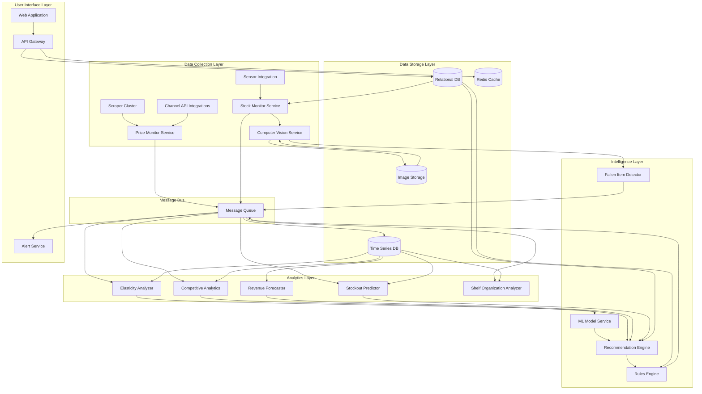

# Design Document: AI Pricing Intelligence Platform

## Overview

The AI Pricing Intelligence Platform is a distributed, event-driven system that provides real-time pricing intelligence, automated pricing optimization, intelligent inventory management, and shelf organization monitoring. The architecture follows a microservices pattern with clear separation between data collection, analysis, recommendation generation, computer vision processing, and user-facing services.

The system processes pricing data from multiple sources, applies machine learning models to understand price elasticity and market dynamics, monitors inventory levels through computer vision and sensors, predicts stockouts, detects fallen items, and generates actionable pricing recommendations that consider both market conditions and inventory status. It operates continuously, monitoring competitor prices, analyzing market conditions, tracking shelf organization, and alerting users to significant changes.

Key design principles:
- **Real-time processing**: Event-driven architecture for sub-15-minute price change detection and sub-2-minute fallen item alerts
- **Scalability**: Horizontal scaling to support 100,000+ products and multiple store locations
- **Reliability**: 99.9% uptime with fault-tolerant components
- **Extensibility**: Plugin architecture for new channels, pricing strategies, and sensor types
- **Security**: End-to-end encryption and role-based access control
- **AI-Driven Intelligence**: Computer vision models for inventory monitoring and shelf organization analysis

## Architecture

The platform consists of the following major subsystems:

### High-Level Architecture



### Architectural Patterns

1. **Event-Driven Architecture**: Price changes trigger events that flow through the system, enabling real-time processing and loose coupling between components.

2. **CQRS (Command Query Responsibility Segregation)**: Separate read and write models optimize for different access patterns. Write operations go through the message queue, while reads use optimized caches and read replicas.

3. **Microservices**: Each major component runs as an independent service, enabling independent scaling and deployment.

4. **Time-Series Optimization**: Historical price data is stored in a time-series database optimized for temporal queries and compression.

## Components and Interfaces

### 1. Price Monitor Service

**Responsibility**: Orchestrates price collection across all channels and manages scraper/API integrations.

**Key Operations**:
- `scheduleMonitoring(productId, channels, frequency)`: Configure monitoring for a product
- `collectPrices(productId, channel)`: Trigger immediate price collection
- `handlePriceUpdate(pricePoint)`: Process incoming price data

**Interfaces**:
```typescript
interface PricePoint {
  productId: string;
  competitorId: string;
  channel: string;
  price: number;
  currency: string;
  timestamp: Date;
  availability: boolean;
  metadata: Record<string, any>;
}

interface MonitoringConfig {
  productId: string;
  channels: string[];
  frequency: number; // minutes
  competitors: string[];
}
```

**Implementation Notes**:
- Uses a job scheduler (e.g., cron-based) to trigger periodic price checks
- Maintains a registry of channel adapters (scrapers, API clients)
- Implements circuit breaker pattern for failing channels
- Publishes price change events to message queue

### 2. Scraper Cluster

**Responsibility**: Executes web scraping for channels without API access.

**Key Operations**:
- `scrape(url, selectors)`: Extract price data from web pages
- `handleAntiBot(challenge)`: Manage anti-bot protections
- `rotateProxies()`: Rotate IP addresses to avoid blocking

**Implementation Notes**:
- Uses headless browsers (Playwright/Puppeteer) for JavaScript-heavy sites
- Implements proxy rotation and user-agent randomization
- Respects robots.txt and rate limits
- Stores scraping templates per channel

### 3. Time Series Database

**Responsibility**: Store and query historical price data efficiently.

**Schema Design**:
```
Measurement: price_points
Tags: product_id, competitor_id, channel
Fields: price, availability
Timestamp: collection_time
```

**Implementation Notes**:
- Use InfluxDB or TimescaleDB for time-series optimization
- Implement downsampling for data older than 90 days (hourly → daily aggregates)
- Create indexes on product_id and timestamp for fast queries
- Set retention policies: raw data 90 days, aggregated data 2 years

### 4. Elasticity Analyzer

**Responsibility**: Calculate price elasticity coefficients from historical data.

**Key Operations**:
- `calculateElasticity(productId, timeRange)`: Compute elasticity coefficient
- `updateElasticityModels()`: Refresh all elasticity calculations
- `getElasticityWithConfidence(productId)`: Retrieve elasticity with confidence interval

**Algorithm**:
```
1. Query historical price and sales data for product
2. If data points < 30, use category-level elasticity
3. Apply log-log regression: log(quantity) = β₀ + β₁ * log(price) + ε
4. Elasticity coefficient = β₁
5. Calculate confidence interval using standard error
6. Store result with timestamp and confidence score
```

**Interfaces**:
```typescript
interface ElasticityResult {
  productId: string;
  coefficient: number; // negative value, e.g., -1.5
  confidenceInterval: [number, number];
  confidenceScore: number; // 0-100
  dataPoints: number;
  calculatedAt: Date;
}
```

### 5. Revenue Forecaster

**Responsibility**: Predict revenue impact of price changes.

**Key Operations**:
- `forecastRevenue(productId, proposedPrice, timeHorizon)`: Predict revenue impact
- `compareScenarios(productId, priceOptions)`: Compare multiple pricing scenarios

**Forecasting Model**:
```
1. Retrieve elasticity coefficient for product
2. Calculate expected demand change: ΔQ = Q₀ * (P₁/P₀)^elasticity
3. Calculate expected revenue: R₁ = P₁ * Q₁
4. Apply seasonal adjustment factors
5. Calculate confidence interval based on elasticity confidence and historical variance
6. Return forecast with expected revenue, margin, and volume
```

**Interfaces**:
```typescript
interface RevenueForecast {
  productId: string;
  currentPrice: number;
  proposedPrice: number;
  expectedRevenue: number;
  expectedMargin: number;
  expectedVolume: number;
  confidenceInterval: {
    revenue: [number, number];
    volume: [number, number];
  };
  timeHorizon: number; // days
}
```

### 6. Recommendation Engine

**Responsibility**: Generate optimal pricing recommendations based on market conditions and business constraints.

**Key Operations**:
- `generateRecommendation(productId, constraints)`: Create pricing recommendation
- `rankStrategies(productId)`: Evaluate multiple pricing strategies
- `explainRecommendation(recommendationId)`: Provide reasoning for recommendation

**Recommendation Algorithm**:
```
1. Gather inputs:
   - Current price and competitor prices
   - Elasticity coefficient
   - Inventory levels and stockout predictions
   - Business constraints (min margin, max discount)
   - Historical performance

2. Generate candidate prices:
   - Competitor matching (match lowest, match average)
   - Margin optimization (maximize margin while maintaining volume)
   - Revenue maximization (optimal price based on elasticity)
   - Market positioning (premium, mid-market, value)
   - Inventory-aware strategies:
     * Clearance pricing (high inventory, approaching expiration)
     * Premium pricing (low inventory, high demand)
     * Stockout prevention (reduce demand through higher prices)

3. For each candidate:
   - Forecast revenue impact
   - Forecast inventory impact (time-to-stockout change)
   - Check constraint compliance
   - Calculate confidence score

4. Apply inventory-based adjustments:
   - If inventory > 150% of target: increase discount recommendations
   - If inventory < 30% of target: increase price recommendations
   - If stockout predicted within 48h: avoid price reductions

5. Rank candidates by expected revenue
6. Return top 3 with explanations
```

**Interfaces**:
```typescript
interface PricingRecommendation {
  productId: string;
  recommendedPrice: number;
  currentPrice: number;
  strategy: 'competitor_match' | 'margin_optimization' | 'revenue_maximization' | 'market_positioning';
  confidenceScore: number; // 0-100
  expectedImpact: {
    revenueChange: number; // percentage
    marginChange: number;
    volumeChange: number;
  };
  reasoning: string[];
  alternatives: Array<{
    price: number;
    strategy: string;
    expectedRevenue: number;
  }>;
  generatedAt: Date;
}

interface PricingConstraints {
  minMargin: number; // percentage
  maxDiscount: number; // percentage
  maxPriceChange: number; // percentage per adjustment
  competitorWeights: Record<string, number>; // importance of each competitor
}
```

### 7. Rules Engine

**Responsibility**: Execute automated pricing adjustments based on user-defined rules.

**Key Operations**:
- `createRule(rule)`: Define new pricing rule
- `evaluateRules(productId, marketConditions)`: Check if rules should trigger
- `executeRule(ruleId, productId)`: Apply price adjustment
- `validateRule(rule)`: Check rule for logical consistency

**Rule Types**:
```typescript
type RuleCondition = 
  | { type: 'competitor_price_below', competitorId: string, threshold: number }
  | { type: 'margin_below', threshold: number }
  | { type: 'inventory_above', threshold: number }
  | { type: 'time_window', start: string, end: string }
  | { type: 'market_average_shift', threshold: number };

type RuleAction = 
  | { type: 'set_price', price: number }
  | { type: 'match_competitor', competitorId: string, offset: number }
  | { type: 'apply_discount', percentage: number }
  | { type: 'use_recommendation', strategy: string };

interface PricingRule {
  id: string;
  name: string;
  productIds: string[];
  conditions: RuleCondition[];
  conditionLogic: 'AND' | 'OR';
  action: RuleAction;
  constraints: PricingConstraints;
  enabled: boolean;
  priority: number;
}
```

**Rule Evaluation Engine**:
```
1. Subscribe to price change events from message queue
2. For each event, query all active rules for affected products
3. Evaluate rule conditions against current market state
4. If conditions met:
   a. Calculate proposed price from action
   b. Validate against constraints
   c. If valid, execute price change and log to audit trail
   d. If invalid, log conflict and send alert
5. Respect rule priority (higher priority rules execute first)
```

### 8. Competitive Analytics Service

**Responsibility**: Analyze competitive positioning and market dynamics.

**Key Operations**:
- `getMarketPosition(productId)`: Calculate price rank and percentile
- `getPriceDistribution(productId)`: Get market price statistics
- `identifyPriceGaps(productId)`: Find significant price differences
- `estimateMarketShare(productId)`: Estimate share based on pricing

**Analytics Calculations**:
```typescript
interface CompetitivePosition {
  productId: string;
  userPrice: number;
  marketStats: {
    min: number;
    max: number;
    median: number;
    mean: number;
    q1: number;
    q3: number;
  };
  priceRank: number; // 1 = lowest price
  percentile: number; // 0-100
  priceGaps: Array<{
    competitorId: string;
    priceDifference: number;
    percentageDifference: number;
  }>;
  estimatedMarketShare: number; // percentage
  calculatedAt: Date;
}
```

### 9. Alert Service

**Responsibility**: Monitor conditions and send notifications to users.

**Key Operations**:
- `createAlert(alertConfig)`: Define alert conditions
- `evaluateAlerts(event)`: Check if events trigger alerts
- `sendNotification(alert, channels)`: Deliver alert via configured channels

**Alert Types**:
```typescript
interface AlertConfig {
  id: string;
  name: string;
  type: 'competitor_price_drop' | 'market_shift' | 'stockout' | 'recommendation_change';
  conditions: {
    productIds?: string[];
    competitorIds?: string[];
    threshold?: number;
  };
  channels: Array<'email' | 'sms' | 'webhook'>;
  frequency: 'immediate' | 'hourly' | 'daily';
  enabled: boolean;
}

interface Alert {
  id: string;
  configId: string;
  type: string;
  severity: 'low' | 'medium' | 'high';
  message: string;
  affectedProducts: string[];
  context: Record<string, any>;
  recommendedActions: string[];
  createdAt: Date;
}
```

### 10. API Gateway

**Responsibility**: Provide REST API for external integrations and web application.

**Key Endpoints**:
```
GET    /api/v1/products/{id}/price-history
GET    /api/v1/products/{id}/recommendations
POST   /api/v1/products/{id}/price
GET    /api/v1/products/{id}/competitive-position
GET    /api/v1/products/{id}/elasticity
POST   /api/v1/products/{id}/forecast
GET    /api/v1/rules
POST   /api/v1/rules
PUT    /api/v1/rules/{id}
DELETE /api/v1/rules/{id}
GET    /api/v1/alerts
POST   /api/v1/alerts
GET    /api/v1/analytics/dashboard
POST   /api/v1/import
GET    /api/v1/export
```

**Authentication & Authorization**:
- JWT-based authentication with refresh tokens
- API key support for service-to-service communication
- Role-based access control (RBAC) with roles: admin, analyst, viewer
- Rate limiting: 1000 requests/minute per user

### 11. Web Application

**Responsibility**: Provide user interface for pricing management and analytics.

**Key Views**:
- Dashboard: Overview of key metrics, active alerts, recent recommendations
- Product Catalog: List of monitored products with current prices and positions
- Competitive Analysis: Price comparison charts and market positioning
- Recommendations: List of pricing recommendations with confidence scores
- Rules Management: Create and manage automated pricing rules
- Analytics: Historical trends, elasticity curves, revenue forecasts
- Alerts: Configure and view alert history
- Inventory Dashboard: Real-time inventory levels, stockout predictions, reorder recommendations
- Shelf Organization: Fallen item alerts, organization quality metrics, store heatmaps

**Technology Stack**:
- React/Vue.js for frontend
- Chart.js/D3.js for visualizations
- WebSocket for real-time updates

### 12. Stock Monitor Service

**Responsibility**: Collect and process inventory level data from cameras, sensors, and other sources.

**Key Operations**:
- `processShelfImage(image, location, timestamp)`: Analyze shelf image for inventory levels
- `processSensorData(sensorType, data, location)`: Handle data from weight sensors, RFID readers
- `updateInventoryLevel(productId, location, quantity)`: Update current inventory
- `getInventoryLevel(productId, location)`: Retrieve current inventory

**Interfaces**:
```typescript
interface InventoryMeasurement {
  productId: string;
  location: string; // Store ID + aisle + shelf
  quantity: number; // Estimated quantity
  confidence: number; // 0-100
  measurementType: 'camera' | 'weight_sensor' | 'rfid' | 'manual';
  timestamp: Date;
  imageId?: string; // Reference to stored image
  metadata: Record<string, any>;
}

interface SensorConfig {
  sensorId: string;
  type: 'camera' | 'weight_sensor' | 'rfid';
  location: string;
  productIds: string[];
  calibration: Record<string, any>;
  active: boolean;
}
```

**Implementation Notes**:
- Integrates with Computer Vision Service for image analysis
- Supports multiple sensor types with adapter pattern
- Publishes inventory change events to message queue
- Handles sensor failures gracefully with fallback to last known values
- Stores raw images for model training and audit purposes

### 13. Computer Vision Service

**Responsibility**: Process shelf images to detect products, estimate quantities, and identify fallen items.

**Key Operations**:
- `detectProducts(image)`: Identify products in shelf image
- `estimateQuantity(image, productId, boundingBox)`: Count product units
- `detectFallenItems(image, shelfLayout)`: Identify products not in proper positions
- `calculateShelfOccupancy(image, shelfLayout)`: Measure shelf fullness

**ML Models**:
```typescript
interface CVModel {
  modelId: string;
  version: string;
  type: 'object_detection' | 'quantity_estimation' | 'fallen_item_detection';
  accuracy: number;
  precision: number;
  recall: number;
  inferenceTimeMs: number;
  deployedAt: Date;
}

interface DetectionResult {
  productId: string;
  boundingBox: {
    x: number;
    y: number;
    width: number;
    height: number;
  };
  confidence: number;
  quantity: number;
  properlyPositioned: boolean;
}
```

**Implementation Notes**:
- Uses deep learning models (YOLO, Faster R-CNN, or similar) for object detection
- Implements model versioning and A/B testing capabilities
- Supports GPU acceleration for faster inference
- Logs predictions with confidence scores for quality monitoring
- Supports hot-swapping of models without downtime

### 14. Stockout Predictor

**Responsibility**: Forecast when products will run out of stock and generate reorder recommendations.

**Key Operations**:
- `predictStockout(productId, location)`: Calculate time-to-stockout
- `generateReorderRecommendation(productId, location)`: Suggest reorder quantity and timing
- `updateSalesVelocity(productId, location)`: Recalculate sales rate

**Prediction Algorithm**:
```
1. Query historical sales data and current inventory level
2. Calculate sales velocity (units per day) with trend analysis
3. Apply seasonal adjustment factors
4. Consider upcoming promotional events
5. Calculate time-to-stockout: inventory / adjusted_velocity
6. Calculate confidence based on data quality and variance
7. If time-to-stockout < threshold, generate reorder recommendation
8. Reorder quantity = (lead_time * velocity) + safety_stock
```

**Interfaces**:
```typescript
interface StockoutPrediction {
  productId: string;
  location: string;
  currentInventory: number;
  salesVelocity: number; // units per day
  timeToStockout: number; // days
  stockoutDate: Date;
  confidence: number; // 0-100
  factors: {
    trend: 'increasing' | 'stable' | 'decreasing';
    seasonalAdjustment: number;
    promotionalImpact: number;
  };
  predictedAt: Date;
}

interface ReorderRecommendation {
  productId: string;
  location: string;
  recommendedQuantity: number;
  urgency: 'critical' | 'high' | 'medium' | 'low';
  estimatedLeadTime: number; // days
  safetyStock: number;
  reasoning: string[];
  generatedAt: Date;
}
```

### 15. Fallen Item Detector

**Responsibility**: Identify products that have fallen from shelves and alert store staff.

**Key Operations**:
- `analyzeFallenItems(detectionResults, shelfLayout)`: Identify misplaced products
- `createFallenItemAlert(productId, location, imageId)`: Generate alert for staff
- `trackResolutionTime(alertId, resolvedAt)`: Measure response times

**Detection Logic**:
```
1. Receive product detection results from Computer Vision Service
2. Load expected shelf layout for location
3. For each detected product:
   a. Check if bounding box intersects with expected shelf position
   b. Check if product is on floor or in wrong section
   c. Calculate confidence based on position deviation
4. If product is misplaced with confidence > 80%:
   a. Create fallen item alert
   b. Publish alert event to message queue
5. Track alert until resolution
```

**Interfaces**:
```typescript
interface FallenItemAlert {
  id: string;
  productId: string;
  location: string;
  detectedAt: Date;
  imageId: string;
  confidence: number;
  position: {
    x: number;
    y: number;
  };
  expectedPosition: {
    shelfId: string;
    section: string;
  };
  status: 'open' | 'acknowledged' | 'resolved';
  acknowledgedAt?: Date;
  resolvedAt?: Date;
  responseTimeMinutes?: number;
}
```

### 16. Shelf Organization Analyzer

**Responsibility**: Calculate shelf organization quality metrics and identify problem areas.

**Key Operations**:
- `calculateOrganizationScore(location, timeRange)`: Compute quality score
- `identifyProblemAreas(location)`: Find areas with frequent issues
- `analyzeCorrelations(location)`: Correlate organization with sales

**Metrics Calculation**:
```
Organization Score = weighted average of:
- Fallen item frequency (30% weight)
- Stockout frequency (30% weight)
- Product placement accuracy (20% weight)
- Shelf fullness (20% weight)

Score range: 0-100 (higher is better)
```

**Interfaces**:
```typescript
interface OrganizationMetrics {
  location: string;
  timeRange: {
    start: Date;
    end: Date;
  };
  overallScore: number; // 0-100
  components: {
    fallenItemScore: number;
    stockoutScore: number;
    placementScore: number;
    fullnessScore: number;
  };
  trends: {
    scoreChange: number; // percentage change from previous period
    direction: 'improving' | 'stable' | 'declining';
  };
  problemAreas: Array<{
    area: string;
    issueType: string;
    frequency: number;
  }>;
  salesCorrelation: number; // correlation coefficient
}
```

## Data Models

### Core Entities

```typescript
// Product
interface Product {
  id: string;
  sku: string;
  name: string;
  category: string;
  brand: string;
  currentPrice: number;
  currency: string;
  costPrice: number;
  minMargin: number;
  inventoryLevel: number;
  targetInventoryLevel: number;
  monitoringConfig: MonitoringConfig;
  createdAt: Date;
  updatedAt: Date;
}

// Competitor
interface Competitor {
  id: string;
  name: string;
  channels: string[];
  importance: number; // 0-1, weight in recommendations
  active: boolean;
}

// Channel
interface Channel {
  id: string;
  name: string;
  type: 'ecommerce' | 'marketplace' | 'physical' | 'api';
  baseUrl?: string;
  apiConfig?: {
    endpoint: string;
    authType: string;
    credentials: Record<string, string>;
  };
  scrapingConfig?: {
    selectors: Record<string, string>;
    rateLimit: number;
  };
  active: boolean;
}

// Store Location
interface StoreLocation {
  id: string;
  name: string;
  address: string;
  type: 'retail' | 'warehouse' | 'distribution_center';
  sensors: SensorConfig[];
  shelfLayouts: ShelfLayout[];
  active: boolean;
}

// Shelf Layout
interface ShelfLayout {
  id: string;
  locationId: string;
  aisle: string;
  shelfId: string;
  sections: Array<{
    sectionId: string;
    productId: string;
    expectedPosition: {
      x: number;
      y: number;
      width: number;
      height: number;
    };
    capacity: number;
  }>;
}

// User
interface User {
  id: string;
  email: string;
  name: string;
  role: 'admin' | 'analyst' | 'viewer' | 'store_manager';
  preferences: {
    defaultCurrency: string;
    timezone: string;
    alertChannels: string[];
  };
  assignedLocations?: string[]; // For store managers
  createdAt: Date;
}

// Audit Log
interface AuditLog {
  id: string;
  userId: string;
  action: string;
  resourceType: string;
  resourceId: string;
  changes: Record<string, any>;
  ipAddress: string;
  timestamp: Date;
}
```

### Database Schema

**Relational Database (PostgreSQL)**:
```sql
-- Products table
CREATE TABLE products (
  id UUID PRIMARY KEY,
  sku VARCHAR(100) UNIQUE NOT NULL,
  name VARCHAR(500) NOT NULL,
  category VARCHAR(100),
  brand VARCHAR(100),
  current_price DECIMAL(10,2),
  currency VARCHAR(3),
  cost_price DECIMAL(10,2),
  min_margin DECIMAL(5,2),
  inventory_level INTEGER,
  target_inventory_level INTEGER,
  monitoring_config JSONB,
  created_at TIMESTAMP DEFAULT NOW(),
  updated_at TIMESTAMP DEFAULT NOW()
);

CREATE INDEX idx_products_category ON products(category);
CREATE INDEX idx_products_brand ON products(brand);

-- Competitors table
CREATE TABLE competitors (
  id UUID PRIMARY KEY,
  name VARCHAR(200) NOT NULL,
  channels TEXT[],
  importance DECIMAL(3,2),
  active BOOLEAN DEFAULT true
);

-- Channels table
CREATE TABLE channels (
  id UUID PRIMARY KEY,
  name VARCHAR(200) NOT NULL,
  type VARCHAR(50) NOT NULL,
  base_url VARCHAR(500),
  api_config JSONB,
  scraping_config JSONB,
  active BOOLEAN DEFAULT true
);

-- Elasticity results table
CREATE TABLE elasticity_results (
  id UUID PRIMARY KEY,
  product_id UUID REFERENCES products(id),
  coefficient DECIMAL(10,4),
  confidence_interval_lower DECIMAL(10,4),
  confidence_interval_upper DECIMAL(10,4),
  confidence_score INTEGER,
  data_points INTEGER,
  calculated_at TIMESTAMP DEFAULT NOW()
);

CREATE INDEX idx_elasticity_product ON elasticity_results(product_id, calculated_at DESC);

-- Recommendations table
CREATE TABLE recommendations (
  id UUID PRIMARY KEY,
  product_id UUID REFERENCES products(id),
  recommended_price DECIMAL(10,2),
  current_price DECIMAL(10,2),
  strategy VARCHAR(50),
  confidence_score INTEGER,
  expected_impact JSONB,
  reasoning TEXT[],
  alternatives JSONB,
  generated_at TIMESTAMP DEFAULT NOW(),
  applied BOOLEAN DEFAULT false,
  applied_at TIMESTAMP
);

CREATE INDEX idx_recommendations_product ON recommendations(product_id, generated_at DESC);

-- Rules table
CREATE TABLE pricing_rules (
  id UUID PRIMARY KEY,
  name VARCHAR(200) NOT NULL,
  product_ids UUID[],
  conditions JSONB NOT NULL,
  condition_logic VARCHAR(10),
  action JSONB NOT NULL,
  constraints JSONB,
  enabled BOOLEAN DEFAULT true,
  priority INTEGER DEFAULT 0,
  created_by UUID REFERENCES users(id),
  created_at TIMESTAMP DEFAULT NOW(),
  updated_at TIMESTAMP DEFAULT NOW()
);

-- Alerts configuration table
CREATE TABLE alert_configs (
  id UUID PRIMARY KEY,
  name VARCHAR(200) NOT NULL,
  type VARCHAR(50) NOT NULL,
  conditions JSONB,
  channels TEXT[],
  frequency VARCHAR(20),
  enabled BOOLEAN DEFAULT true,
  user_id UUID REFERENCES users(id),
  created_at TIMESTAMP DEFAULT NOW()
);

-- Alerts history table
CREATE TABLE alerts (
  id UUID PRIMARY KEY,
  config_id UUID REFERENCES alert_configs(id),
  type VARCHAR(50),
  severity VARCHAR(20),
  message TEXT,
  affected_products UUID[],
  context JSONB,
  recommended_actions TEXT[],
  created_at TIMESTAMP DEFAULT NOW(),
  acknowledged BOOLEAN DEFAULT false,
  acknowledged_at TIMESTAMP
);

CREATE INDEX idx_alerts_created ON alerts(created_at DESC);

-- Users table
CREATE TABLE users (
  id UUID PRIMARY KEY,
  email VARCHAR(255) UNIQUE NOT NULL,
  name VARCHAR(200),
  password_hash VARCHAR(255),
  role VARCHAR(20) NOT NULL,
  preferences JSONB,
  created_at TIMESTAMP DEFAULT NOW(),
  last_login TIMESTAMP
);

-- Audit log table
CREATE TABLE audit_logs (
  id UUID PRIMARY KEY,
  user_id UUID REFERENCES users(id),
  action VARCHAR(100) NOT NULL,
  resource_type VARCHAR(50),
  resource_id UUID,
  changes JSONB,
  ip_address INET,
  timestamp TIMESTAMP DEFAULT NOW()
);

CREATE INDEX idx_audit_logs_timestamp ON audit_logs(timestamp DESC);
CREATE INDEX idx_audit_logs_user ON audit_logs(user_id, timestamp DESC);

-- Store locations table
CREATE TABLE store_locations (
  id UUID PRIMARY KEY,
  name VARCHAR(200) NOT NULL,
  address TEXT,
  type VARCHAR(50) NOT NULL,
  active BOOLEAN DEFAULT true,
  created_at TIMESTAMP DEFAULT NOW()
);

-- Sensors table
CREATE TABLE sensors (
  id UUID PRIMARY KEY,
  location_id UUID REFERENCES store_locations(id),
  type VARCHAR(50) NOT NULL,
  location_detail VARCHAR(200),
  product_ids UUID[],
  calibration JSONB,
  active BOOLEAN DEFAULT true,
  created_at TIMESTAMP DEFAULT NOW()
);

CREATE INDEX idx_sensors_location ON sensors(location_id);

-- Shelf layouts table
CREATE TABLE shelf_layouts (
  id UUID PRIMARY KEY,
  location_id UUID REFERENCES store_locations(id),
  aisle VARCHAR(50),
  shelf_id VARCHAR(50),
  sections JSONB NOT NULL,
  created_at TIMESTAMP DEFAULT NOW(),
  updated_at TIMESTAMP DEFAULT NOW()
);

CREATE INDEX idx_shelf_layouts_location ON shelf_layouts(location_id);

-- Inventory measurements table
CREATE TABLE inventory_measurements (
  id UUID PRIMARY KEY,
  product_id UUID REFERENCES products(id),
  location VARCHAR(200) NOT NULL,
  quantity INTEGER NOT NULL,
  confidence INTEGER,
  measurement_type VARCHAR(50) NOT NULL,
  image_id VARCHAR(200),
  metadata JSONB,
  timestamp TIMESTAMP DEFAULT NOW()
);

CREATE INDEX idx_inventory_measurements_product ON inventory_measurements(product_id, timestamp DESC);
CREATE INDEX idx_inventory_measurements_location ON inventory_measurements(location, timestamp DESC);

-- Stockout predictions table
CREATE TABLE stockout_predictions (
  id UUID PRIMARY KEY,
  product_id UUID REFERENCES products(id),
  location VARCHAR(200) NOT NULL,
  current_inventory INTEGER NOT NULL,
  sales_velocity DECIMAL(10,2) NOT NULL,
  time_to_stockout DECIMAL(10,2),
  stockout_date TIMESTAMP,
  confidence INTEGER,
  factors JSONB,
  predicted_at TIMESTAMP DEFAULT NOW()
);

CREATE INDEX idx_stockout_predictions_product ON stockout_predictions(product_id, predicted_at DESC);
CREATE INDEX idx_stockout_predictions_urgency ON stockout_predictions(time_to_stockout ASC) WHERE time_to_stockout < 7;

-- Reorder recommendations table
CREATE TABLE reorder_recommendations (
  id UUID PRIMARY KEY,
  product_id UUID REFERENCES products(id),
  location VARCHAR(200) NOT NULL,
  recommended_quantity INTEGER NOT NULL,
  urgency VARCHAR(20) NOT NULL,
  estimated_lead_time INTEGER,
  safety_stock INTEGER,
  reasoning TEXT[],
  generated_at TIMESTAMP DEFAULT NOW(),
  applied BOOLEAN DEFAULT false,
  applied_at TIMESTAMP
);

CREATE INDEX idx_reorder_recommendations_product ON reorder_recommendations(product_id, generated_at DESC);
CREATE INDEX idx_reorder_recommendations_urgency ON reorder_recommendations(urgency, generated_at DESC);

-- Fallen item alerts table
CREATE TABLE fallen_item_alerts (
  id UUID PRIMARY KEY,
  product_id UUID REFERENCES products(id),
  location VARCHAR(200) NOT NULL,
  detected_at TIMESTAMP DEFAULT NOW(),
  image_id VARCHAR(200),
  confidence INTEGER,
  position JSONB,
  expected_position JSONB,
  status VARCHAR(20) DEFAULT 'open',
  acknowledged_at TIMESTAMP,
  resolved_at TIMESTAMP,
  response_time_minutes INTEGER
);

CREATE INDEX idx_fallen_item_alerts_status ON fallen_item_alerts(status, detected_at DESC);
CREATE INDEX idx_fallen_item_alerts_location ON fallen_item_alerts(location, detected_at DESC);

-- Organization metrics table
CREATE TABLE organization_metrics (
  id UUID PRIMARY KEY,
  location VARCHAR(200) NOT NULL,
  time_range_start TIMESTAMP NOT NULL,
  time_range_end TIMESTAMP NOT NULL,
  overall_score INTEGER,
  component_scores JSONB,
  trends JSONB,
  problem_areas JSONB,
  sales_correlation DECIMAL(5,4),
  calculated_at TIMESTAMP DEFAULT NOW()
);

CREATE INDEX idx_organization_metrics_location ON organization_metrics(location, time_range_end DESC);

-- CV models table
CREATE TABLE cv_models (
  id UUID PRIMARY KEY,
  model_id VARCHAR(100) UNIQUE NOT NULL,
  version VARCHAR(50) NOT NULL,
  type VARCHAR(50) NOT NULL,
  accuracy DECIMAL(5,4),
  precision_score DECIMAL(5,4),
  recall_score DECIMAL(5,4),
  inference_time_ms INTEGER,
  deployed_at TIMESTAMP,
  active BOOLEAN DEFAULT false,
  model_path VARCHAR(500),
  metadata JSONB
);

CREATE INDEX idx_cv_models_type ON cv_models(type, deployed_at DESC);
```

**Time-Series Database (InfluxDB)**:
```
Measurement: price_points
  Tags:
    - product_id
    - competitor_id
    - channel
  Fields:
    - price (float)
    - availability (boolean)
    - metadata (json)
  Timestamp: collection_time

Measurement: sales_data
  Tags:
    - product_id
    - channel
  Fields:
    - quantity (integer)
    - revenue (float)
    - price (float)
  Timestamp: sale_time

Measurement: inventory_levels
  Tags:
    - product_id
    - location
    - measurement_type
  Fields:
    - quantity (integer)
    - confidence (integer)
  Timestamp: measurement_time

Measurement: shelf_events
  Tags:
    - location
    - event_type (fallen_item, stockout, restock)
  Fields:
    - product_id (string)
    - severity (string)
  Timestamp: event_time
```

**Cache Layer (Redis)**:
```
Key patterns:
- product:{id}:current_price -> Price data (TTL: 5 minutes)
- product:{id}:recommendations -> Latest recommendations (TTL: 30 minutes)
- product:{id}:competitive_position -> Market position (TTL: 15 minutes)
- product:{id}:elasticity -> Elasticity coefficient (TTL: 1 week)
- product:{id}:inventory:{location} -> Current inventory level (TTL: 2 minutes)
- product:{id}:stockout_prediction -> Stockout forecast (TTL: 1 hour)
- location:{id}:fallen_items -> Active fallen item alerts (TTL: 5 minutes)
- location:{id}:organization_score -> Shelf organization metrics (TTL: 1 hour)
- user:{id}:session -> Session data (TTL: 24 hours)
- rate_limit:{user_id}:{endpoint} -> API rate limiting (TTL: 1 minute)
- cv_model:{type}:active -> Active model version (TTL: 1 hour)
```

**Image Storage (S3 or similar)**:
```
Bucket structure:
- shelf-images/{location_id}/{date}/{timestamp}.jpg
- fallen-items/{alert_id}/{timestamp}.jpg
- training-data/{model_type}/{label}/{image_id}.jpg
```


## Correctness Properties

*A property is a characteristic or behavior that should hold true across all valid executions of a system—essentially, a formal statement about what the system should do. Properties serve as the bridge between human-readable specifications and machine-verifiable correctness guarantees.*

### Property 1: Monitoring Configuration Completeness

*For any* product configured for monitoring with a set of channels, the Price Monitor should actively track prices on all specified channels.

**Validates: Requirements 1.1**

### Property 2: Price Point Data Completeness

*For any* price point collected by the system, it must include all required fields: timestamp, channel identifier, competitor identifier, product identifier, and price value.

**Validates: Requirements 1.3**

### Property 3: Fault Isolation in Channel Monitoring

*For any* monitoring configuration with multiple channels, when one channel fails, the Price Monitor should continue successfully monitoring all other operational channels.

**Validates: Requirements 1.4**

### Property 4: Price Data Persistence Round-Trip

*For any* price point written to storage, querying the system for that product, competitor, channel, and timestamp should return an equivalent price point with no data loss.

**Validates: Requirements 2.1, 2.5**

### Property 5: Elasticity Calculation Completeness

*For any* product with sufficient historical data, the Elasticity Analyzer should produce a result that includes: coefficient, confidence interval (lower and upper bounds), confidence score, and data point count. Where data is insufficient, the result should indicate low confidence and use category-level estimates.

**Validates: Requirements 3.1, 3.3, 3.4**

### Property 6: Elasticity Data Usage

*For any* product with 90 or more days of historical data, the elasticity calculation should use at least 90 days of data in its analysis.

**Validates: Requirements 3.2**

### Property 7: Recommendation Input Sensitivity

*For any* product, changing any of the following inputs (competitor prices, elasticity data, inventory levels, or business rules) should produce a different recommendation or affect the confidence score.

**Validates: Requirements 4.2**

### Property 8: Recommendation Output Structure

*For any* pricing recommendation generated, it must include: recommended price, confidence score (0-100), expected impact metrics, and when multiple strategies are viable, exactly 3 alternative options with expected outcomes.

**Validates: Requirements 4.3, 4.5**

### Property 9: Pricing Constraint Enforcement

*For any* pricing recommendation or automated rule execution, the resulting price must satisfy all user-defined constraints including minimum margin, maximum discount, and maximum price change limits.

**Validates: Requirements 4.4, 7.3**

### Property 10: Forecast Input Sensitivity

*For any* product, changing any of the following inputs (elasticity data, historical sales patterns, or seasonal factors) should produce a different revenue forecast.

**Validates: Requirements 5.2**

### Property 11: Forecast Output Completeness

*For any* revenue forecast generated, it must include: expected revenue change, expected margin change, expected volume change, and confidence intervals for all predictions.

**Validates: Requirements 5.3, 5.4**

### Property 12: Forecast Variance Logging

*For any* forecast where actual results differ from predicted results by more than 20%, the system should create a log entry recording the variance for model improvement.

**Validates: Requirements 5.5**

### Property 13: Competitive Rank Calculation Correctness

*For any* product with competitor prices, the calculated price rank should equal the product's position when all prices (user's and competitors') are sorted in ascending order.

**Validates: Requirements 6.1**

### Property 14: Price Distribution Statistics Correctness

*For any* set of competitor prices for a product, the calculated statistics (minimum, maximum, median, Q1, Q3) should match the results of standard statistical calculations on that price set.

**Validates: Requirements 6.2**

### Property 15: Price Gap Detection

*For any* product where the user's price differs from the market median by more than a defined threshold (e.g., 20%), the system should flag and highlight this as a significant price gap.

**Validates: Requirements 6.5**

### Property 16: Pricing Rule Validation

*For any* pricing rule submitted by a user, the Rules Engine should reject rules that contain logical inconsistencies or violate system constraints, and accept rules that are logically consistent and constraint-compliant.

**Validates: Requirements 7.1**

### Property 17: Rule Constraint Safety

*For any* pricing rule that would produce a price violating user-defined constraints, the Rules Engine should not execute the price change, should log the conflict, and should notify the user.

**Validates: Requirements 7.5**

### Property 18: Automated Price Change Audit Trail

*For any* automated price change executed by the Rules Engine or any access to sensitive pricing data, the system should create an audit log entry containing: user/rule identifier, timestamp, action performed, resource affected, and changes made.

**Validates: Requirements 7.6, 11.5**

### Property 19: Alert Delivery Completeness

*For any* market event that meets user-defined alert criteria, the Alert System should deliver notifications via all configured channels (email, SMS, webhook) and include all required context: affected products, competitors, and recommended actions.

**Validates: Requirements 8.2, 8.4**

### Property 20: Alert Batching Under High Frequency

*For any* time window where alert frequency would exceed user-defined thresholds, the Alert System should batch multiple alerts into a single notification rather than sending each individually.

**Validates: Requirements 8.5**

### Property 21: API Authentication and Authorization

*For any* API request without valid authentication credentials, the system should reject the request with 401 status. For any authenticated request, the system should enforce role-based access control, allowing access only to resources permitted for that user's role.

**Validates: Requirements 9.2, 11.1, 11.2**

### Property 22: API Rate Limiting

*For any* user exceeding the API rate limit (1000 requests/minute), the system should return HTTP 429 status with a retry-after header indicating when requests can resume.

**Validates: Requirements 9.3**

### Property 23: Data Import Round-Trip

*For any* valid data file in supported formats (CSV, JSON, e-commerce platform formats), importing then exporting the data should produce equivalent data with no loss of information.

**Validates: Requirements 9.4, 9.5**

### Property 24: Webhook Event Notification

*For any* significant event (price change, new recommendation, alert), when webhooks are configured, the system should deliver webhook notifications with correct event type and complete payload data.

**Validates: Requirements 9.6**

### Property 25: Dashboard Data Completeness

*For any* user accessing the dashboard, the displayed data must include all required metrics: average price position, revenue trends, and active alerts count.

**Validates: Requirements 10.1**

### Property 26: Data Filtering Correctness

*For any* filter applied (by product category, channel, time period, or competitor), all returned results should match the filter criteria, and no matching items should be excluded.

**Validates: Requirements 10.4**

### Property 27: Security Alert Triggering

*For any* access pattern that matches suspicious behavior criteria (e.g., excessive failed logins, unusual access times, rapid data extraction), the system should trigger a security alert and optionally lock the account.

**Validates: Requirements 11.6**

### Property 28: Inventory Measurement Data Completeness

*For any* inventory measurement stored by the system, querying for that product, location, and timestamp should return a measurement with all required fields: timestamp, location, product identifier, quantity estimate, confidence score, and measurement type.

**Validates: Requirements 13.3**

### Property 29: Inventory Level Update Consistency

*For any* product, when new inventory data is collected for a location, the product's current inventory level for that location should reflect the new measurement value.

**Validates: Requirements 13.4**

### Property 30: Sensor Failure Graceful Degradation

*For any* product with a last known inventory level, when sensor data becomes unavailable or unreliable, the system should log the failure and the inventory level should remain at the last known value (not become null or invalid).

**Validates: Requirements 13.6**

### Property 31: Stockout Prediction Generation

*For any* product with sufficient historical sales velocity data and current inventory data, the Stockout Predictor should generate a time-to-stockout forecast.

**Validates: Requirements 14.1**

### Property 32: Reorder Recommendation Generation

*For any* product with a stockout prediction showing time-to-stockout less than 48 hours, the system should generate a reorder recommendation with suggested quantity.

**Validates: Requirements 14.2**

### Property 33: Stockout Prediction Input Sensitivity

*For any* product, changing any of the following inputs (sales velocity trends, seasonal patterns, or promotional events) should produce a different stockout prediction or affect the confidence score.

**Validates: Requirements 14.3**

### Property 34: Stockout Prediction Confidence Completeness

*For any* stockout prediction generated, it must include a confidence score between 0 and 100.

**Validates: Requirements 14.4**

### Property 35: High-Confidence Stockout Alerts

*For any* stockout prediction with confidence score exceeding 80%, the Alert System should generate a notification for relevant personnel.

**Validates: Requirements 14.5**

### Property 36: High Inventory Clearance Pricing

*For any* product with inventory level above 150% of target inventory, the Recommendation Engine should include clearance pricing strategies with increased discounts in its recommendations.

**Validates: Requirements 15.1**

### Property 37: Low Inventory Premium Pricing

*For any* product with inventory level below 30% of target inventory, the Recommendation Engine should include premium pricing strategies to maximize margin in its recommendations.

**Validates: Requirements 15.2**

### Property 38: Inventory-Aware Recommendation Input Sensitivity

*For any* product, changing the inventory level should produce different pricing recommendations or affect the recommended strategy type.

**Validates: Requirements 15.3**

### Property 39: Stockout Prevention Pricing Constraint

*For any* product with an active stockout prediction, the Recommendation Engine should not suggest price reductions that would accelerate inventory depletion (recommended price should not be significantly lower than current price).

**Validates: Requirements 15.5**

### Property 40: Fallen Item Alert Creation

*For any* fallen item detected by the system, an alert should be created containing all required fields: location, product identifier, image timestamp, confidence score, and position data.

**Validates: Requirements 16.2**

### Property 41: Fallen Item Alert Routing

*For any* fallen item alert generated, notifications should be delivered to all configured channels for store staff (mobile devices, in-store systems).

**Validates: Requirements 16.4**

### Property 42: Fallen Item Alert Batching

*For any* time window where multiple fallen items are detected in the same location, the system should batch these into fewer notifications rather than sending individual alerts for each item.

**Validates: Requirements 16.6**

### Property 43: Organization Score Calculation Correctness

*For any* location with event data, the calculated shelf organization score should be based on the weighted combination of fallen item frequency (30%), stockout frequency (30%), product placement accuracy (20%), and shelf fullness (20%).

**Validates: Requirements 17.1**

### Property 44: Low Organization Score Alerts

*For any* location where the organization score falls below the defined threshold, the system should generate an alert for management review.

**Validates: Requirements 17.4**

### Property 45: Model Performance Metrics Tracking

*For any* deployed computer vision model, the system should maintain and provide access to performance metrics including accuracy, precision, recall, and inference time.

**Validates: Requirements 18.3**

### Property 46: Model Degradation Alerts

*For any* computer vision model where accuracy degrades below 80%, the system should trigger an alert for administrators.

**Validates: Requirements 18.4**

### Property 47: Model Prediction Logging

*For any* prediction made by a computer vision model, the system should create a log entry containing the prediction result and confidence score.

**Validates: Requirements 18.6**

## Error Handling

### Error Categories

The platform handles errors across several categories:

1. **External Service Failures**
   - Channel unavailability (website down, API timeout)
   - Network connectivity issues
   - Rate limiting by external services

2. **Data Quality Issues**
   - Missing or incomplete price data
   - Insufficient historical data for analysis
   - Outlier detection (prices that are clearly erroneous)

3. **Business Rule Violations**
   - Pricing constraints violated
   - Margin requirements not met
   - Invalid rule configurations

4. **System Errors**
   - Database connection failures
   - Message queue unavailability
   - Service crashes or timeouts

### Error Handling Strategies

**Circuit Breaker Pattern** (for external services):
```typescript
class CircuitBreaker {
  private failureCount: number = 0;
  private lastFailureTime: Date | null = null;
  private state: 'CLOSED' | 'OPEN' | 'HALF_OPEN' = 'CLOSED';
  
  async execute<T>(operation: () => Promise<T>): Promise<T> {
    if (this.state === 'OPEN') {
      if (Date.now() - this.lastFailureTime!.getTime() > 60000) {
        this.state = 'HALF_OPEN';
      } else {
        throw new Error('Circuit breaker is OPEN');
      }
    }
    
    try {
      const result = await operation();
      if (this.state === 'HALF_OPEN') {
        this.state = 'CLOSED';
        this.failureCount = 0;
      }
      return result;
    } catch (error) {
      this.failureCount++;
      this.lastFailureTime = new Date();
      
      if (this.failureCount >= 5) {
        this.state = 'OPEN';
      }
      throw error;
    }
  }
}
```

**Retry with Exponential Backoff** (for transient failures):
```typescript
async function retryWithBackoff<T>(
  operation: () => Promise<T>,
  maxRetries: number = 3,
  baseDelay: number = 1000
): Promise<T> {
  for (let attempt = 0; attempt < maxRetries; attempt++) {
    try {
      return await operation();
    } catch (error) {
      if (attempt === maxRetries - 1) throw error;
      
      const delay = baseDelay * Math.pow(2, attempt);
      await new Promise(resolve => setTimeout(resolve, delay));
    }
  }
  throw new Error('Max retries exceeded');
}
```

**Graceful Degradation** (for missing data):
```typescript
async function getElasticity(productId: string): Promise<ElasticityResult> {
  const productData = await getHistoricalData(productId);
  
  if (productData.length < 30) {
    // Insufficient data - use category-level estimate
    const category = await getProductCategory(productId);
    const categoryElasticity = await getCategoryElasticity(category);
    
    return {
      productId,
      coefficient: categoryElasticity.coefficient,
      confidenceInterval: categoryElasticity.confidenceInterval,
      confidenceScore: 30, // Low confidence
      dataPoints: productData.length,
      calculatedAt: new Date(),
      fallbackUsed: true,
      fallbackType: 'category'
    };
  }
  
  // Sufficient data - calculate product-specific elasticity
  return calculateProductElasticity(productData);
}
```

**Dead Letter Queue** (for failed message processing):
```typescript
async function processMessage(message: Message): Promise<void> {
  try {
    await handleMessage(message);
    await message.ack();
  } catch (error) {
    message.retryCount = (message.retryCount || 0) + 1;
    
    if (message.retryCount >= 3) {
      // Move to dead letter queue for manual investigation
      await deadLetterQueue.send(message);
      await message.ack();
      await alertOps('Message moved to DLQ', { messageId: message.id, error });
    } else {
      // Requeue with delay
      await message.nack();
    }
  }
}
```

### Error Response Format

All API errors follow a consistent format:

```typescript
interface ErrorResponse {
  error: {
    code: string; // Machine-readable error code
    message: string; // Human-readable message
    details?: Record<string, any>; // Additional context
    timestamp: string;
    requestId: string; // For tracing
  };
}

// Example error responses:
{
  "error": {
    "code": "INSUFFICIENT_DATA",
    "message": "Cannot calculate elasticity: only 15 days of historical data available (minimum 30 required)",
    "details": {
      "productId": "prod_123",
      "dataPoints": 15,
      "minimumRequired": 30
    },
    "timestamp": "2024-01-15T10:30:00Z",
    "requestId": "req_abc123"
  }
}

{
  "error": {
    "code": "CONSTRAINT_VIOLATION",
    "message": "Recommended price violates minimum margin constraint",
    "details": {
      "productId": "prod_456",
      "recommendedPrice": 19.99,
      "costPrice": 18.00,
      "calculatedMargin": 9.95,
      "minimumMargin": 15.00
    },
    "timestamp": "2024-01-15T10:31:00Z",
    "requestId": "req_def456"
  }
}
```

## Testing Strategy

The AI Pricing Intelligence Platform requires comprehensive testing across multiple dimensions to ensure correctness, reliability, and performance. We employ a dual testing approach combining unit tests for specific scenarios and property-based tests for universal correctness guarantees.

### Testing Approach

**Unit Tests**: Focus on specific examples, edge cases, and integration points between components. Unit tests validate concrete scenarios and ensure individual components work correctly in isolation.

**Property-Based Tests**: Verify universal properties that should hold across all inputs. Each property test runs a minimum of 100 iterations with randomly generated inputs to catch edge cases that might be missed by example-based tests. Property tests provide mathematical confidence in system correctness.

Together, these approaches provide comprehensive coverage: unit tests catch concrete bugs and validate specific behaviors, while property tests verify general correctness across the input space.

### Property-Based Testing Configuration

**Testing Library**: Use `fast-check` for TypeScript/JavaScript, `Hypothesis` for Python, or `QuickCheck` for Haskell depending on implementation language.

**Test Configuration**:
- Minimum 100 iterations per property test
- Each test must reference its design document property
- Tag format: `Feature: ai-pricing-intelligence, Property {number}: {property_text}`

**Example Property Test Structure**:

```typescript
import fc from 'fast-check';

describe('Price Monitor - Property Tests', () => {
  // Feature: ai-pricing-intelligence, Property 1: Monitoring Configuration Completeness
  it('should track prices on all configured channels', () => {
    fc.assert(
      fc.property(
        fc.record({
          productId: fc.uuid(),
          channels: fc.array(fc.string(), { minLength: 1, maxLength: 10 }),
          competitors: fc.array(fc.uuid(), { minLength: 1 })
        }),
        async (config) => {
          const monitor = new PriceMonitor();
          await monitor.configure(config);
          
          const activeChannels = await monitor.getActiveChannels(config.productId);
          
          // All configured channels should be actively monitored
          expect(activeChannels.sort()).toEqual(config.channels.sort());
        }
      ),
      { numRuns: 100 }
    );
  });

  // Feature: ai-pricing-intelligence, Property 2: Price Point Data Completeness
  it('should include all required fields in collected price points', () => {
    fc.assert(
      fc.property(
        fc.record({
          productId: fc.uuid(),
          competitorId: fc.uuid(),
          channel: fc.string(),
          price: fc.float({ min: 0.01, max: 10000 })
        }),
        async (input) => {
          const pricePoint = await collectPrice(input);
          
          // All required fields must be present and valid
          expect(pricePoint.productId).toBeDefined();
          expect(pricePoint.competitorId).toBeDefined();
          expect(pricePoint.channel).toBeDefined();
          expect(pricePoint.price).toBeGreaterThan(0);
          expect(pricePoint.timestamp).toBeInstanceOf(Date);
        }
      ),
      { numRuns: 100 }
    );
  });

  // Feature: ai-pricing-intelligence, Property 3: Fault Isolation in Channel Monitoring
  it('should continue monitoring other channels when one fails', () => {
    fc.assert(
      fc.property(
        fc.record({
          productId: fc.uuid(),
          workingChannels: fc.array(fc.string(), { minLength: 2, maxLength: 5 }),
          failingChannel: fc.string()
        }),
        async (config) => {
          const allChannels = [...config.workingChannels, config.failingChannel];
          const monitor = new PriceMonitor();
          
          // Configure one channel to fail
          monitor.setChannelBehavior(config.failingChannel, 'fail');
          
          await monitor.configure({
            productId: config.productId,
            channels: allChannels,
            competitors: ['comp1']
          });
          
          await monitor.collectPrices(config.productId);
          
          // Working channels should have collected prices
          for (const channel of config.workingChannels) {
            const prices = await getPricesForChannel(config.productId, channel);
            expect(prices.length).toBeGreaterThan(0);
          }
          
          // Failing channel should be logged but not block others
          const failures = await monitor.getFailures();
          expect(failures).toContainEqual(
            expect.objectContaining({ channel: config.failingChannel })
          );
        }
      ),
      { numRuns: 100 }
    );
  });
});

describe('Recommendation Engine - Property Tests', () => {
  // Feature: ai-pricing-intelligence, Property 9: Pricing Constraint Enforcement
  it('should never violate user-defined pricing constraints', () => {
    fc.assert(
      fc.property(
        fc.record({
          productId: fc.uuid(),
          currentPrice: fc.float({ min: 10, max: 100 }),
          costPrice: fc.float({ min: 5, max: 50 }),
          constraints: fc.record({
            minMargin: fc.float({ min: 10, max: 50 }),
            maxDiscount: fc.float({ min: 5, max: 30 }),
            maxPriceChange: fc.float({ min: 5, max: 20 })
          }),
          marketConditions: fc.record({
            competitorPrices: fc.array(fc.float({ min: 8, max: 120 }), { minLength: 1 }),
            elasticity: fc.float({ min: -3, max: -0.5 })
          })
        }),
        async (input) => {
          const recommendation = await generateRecommendation(
            input.productId,
            input.constraints,
            input.marketConditions
          );
          
          // Calculate actual margin
          const margin = ((recommendation.recommendedPrice - input.costPrice) / recommendation.recommendedPrice) * 100;
          expect(margin).toBeGreaterThanOrEqual(input.constraints.minMargin);
          
          // Check discount limit
          const discount = ((input.currentPrice - recommendation.recommendedPrice) / input.currentPrice) * 100;
          if (discount > 0) {
            expect(discount).toBeLessThanOrEqual(input.constraints.maxDiscount);
          }
          
          // Check price change limit
          const priceChange = Math.abs((recommendation.recommendedPrice - input.currentPrice) / input.currentPrice) * 100;
          expect(priceChange).toBeLessThanOrEqual(input.constraints.maxPriceChange);
        }
      ),
      { numRuns: 100 }
    );
  });
});
```

### Unit Testing Strategy

**Component-Level Tests**:
- Test each service independently with mocked dependencies
- Focus on edge cases: empty data, boundary values, error conditions
- Validate integration points between services

**Example Unit Tests**:

```typescript
describe('Elasticity Analyzer - Unit Tests', () => {
  it('should use category-level elasticity when data is insufficient', async () => {
    const analyzer = new ElasticityAnalyzer();
    const productId = 'prod_123';
    
    // Only 20 days of data (below 30-day minimum)
    const insufficientData = generateHistoricalData(20);
    mockHistoricalDataService.getData.mockResolvedValue(insufficientData);
    mockProductService.getCategory.mockResolvedValue('electronics');
    mockCategoryService.getElasticity.mockResolvedValue({
      coefficient: -1.5,
      confidenceInterval: [-1.8, -1.2]
    });
    
    const result = await analyzer.calculateElasticity(productId);
    
    expect(result.confidenceScore).toBeLessThan(50);
    expect(result.fallbackUsed).toBe(true);
    expect(result.fallbackType).toBe('category');
    expect(result.coefficient).toBe(-1.5);
  });

  it('should handle empty price history gracefully', async () => {
    const analyzer = new ElasticityAnalyzer();
    mockHistoricalDataService.getData.mockResolvedValue([]);
    
    const result = await analyzer.calculateElasticity('prod_456');
    
    expect(result.confidenceScore).toBe(0);
    expect(result.dataPoints).toBe(0);
  });
});

describe('Rules Engine - Unit Tests', () => {
  it('should reject rules with conflicting constraints', async () => {
    const engine = new RulesEngine();
    
    const invalidRule: PricingRule = {
      id: 'rule_1',
      name: 'Invalid Rule',
      productIds: ['prod_1'],
      conditions: [{ type: 'competitor_price_below', competitorId: 'comp_1', threshold: 50 }],
      conditionLogic: 'AND',
      action: { type: 'set_price', price: 45 },
      constraints: {
        minMargin: 30, // 30% margin
        maxDiscount: 5, // Max 5% discount
        maxPriceChange: 10
      },
      enabled: true,
      priority: 1
    };
    
    // If cost is $40, price of $45 gives only 11% margin, violating 30% constraint
    mockProductService.getCostPrice.mockResolvedValue(40);
    
    await expect(engine.createRule(invalidRule)).rejects.toThrow('Constraint violation');
  });

  it('should execute competitor matching rule correctly', async () => {
    const engine = new RulesEngine();
    const productId = 'prod_1';
    
    const rule: PricingRule = {
      id: 'rule_1',
      name: 'Match Competitor',
      productIds: [productId],
      conditions: [{ type: 'competitor_price_below', competitorId: 'comp_1', threshold: 100 }],
      conditionLogic: 'AND',
      action: { type: 'match_competitor', competitorId: 'comp_1', offset: -0.50 },
      constraints: { minMargin: 15, maxDiscount: 20, maxPriceChange: 15 },
      enabled: true,
      priority: 1
    };
    
    mockPriceService.getCompetitorPrice.mockResolvedValue(95);
    mockProductService.getCurrentPrice.mockResolvedValue(100);
    mockProductService.getCostPrice.mockResolvedValue(75);
    
    await engine.evaluateRules(productId, { competitorPrices: { comp_1: 95 } });
    
    // Should set price to $94.50 (competitor price - $0.50)
    expect(mockPriceService.setPrice).toHaveBeenCalledWith(productId, 94.50);
  });
});
```

### Integration Testing

**End-to-End Scenarios**:
- Test complete workflows from price collection to recommendation generation
- Validate message flow through the event bus
- Test API endpoints with realistic payloads

**Example Integration Test**:

```typescript
describe('Price Change to Recommendation Flow', () => {
  it('should generate new recommendation when competitor price drops', async () => {
    const productId = 'prod_1';
    
    // Setup: Product with current price $100
    await setupProduct(productId, { currentPrice: 100, costPrice: 70 });
    
    // Simulate competitor price drop
    await priceMonitor.reportPriceChange({
      productId,
      competitorId: 'comp_1',
      channel: 'amazon',
      price: 85,
      timestamp: new Date()
    });
    
    // Wait for event processing
    await waitForEventProcessing();
    
    // Should trigger new recommendation
    const recommendations = await recommendationService.getLatest(productId);
    expect(recommendations.length).toBeGreaterThan(0);
    expect(recommendations[0].recommendedPrice).toBeLessThan(100);
    
    // Should trigger alert
    const alerts = await alertService.getRecent(productId);
    expect(alerts).toContainEqual(
      expect.objectContaining({
        type: 'competitor_price_drop',
        affectedProducts: [productId]
      })
    );
  });
});
```

### Performance Testing

While not part of property-based testing, performance tests validate non-functional requirements:

- Load testing: 1000 requests/minute for recommendation endpoint
- Scalability testing: 100,000 products monitored simultaneously
- Query performance: 95% of queries complete within 2 seconds
- Price detection latency: Changes detected within 15 minutes

### Test Coverage Goals

- Unit test coverage: >80% of code
- Property test coverage: 100% of correctness properties
- Integration test coverage: All critical user workflows
- API test coverage: All public endpoints

### Continuous Testing

- Run unit tests on every commit
- Run property tests on every pull request
- Run integration tests nightly
- Run performance tests weekly
- Monitor production metrics for regression detection
